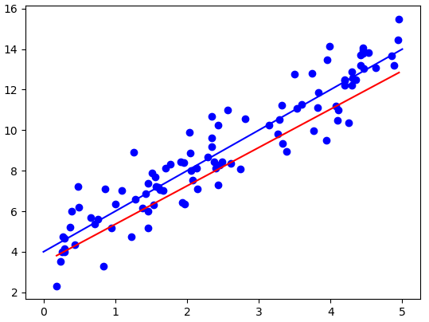

# MLP

An implementation of a multilayer perceptron with backpropagation as described in 6.5. The mlp is implemented as a stream of operators on matrices.

Examples of linear regression and XOR are given.

### Screenshot of linear regression:

