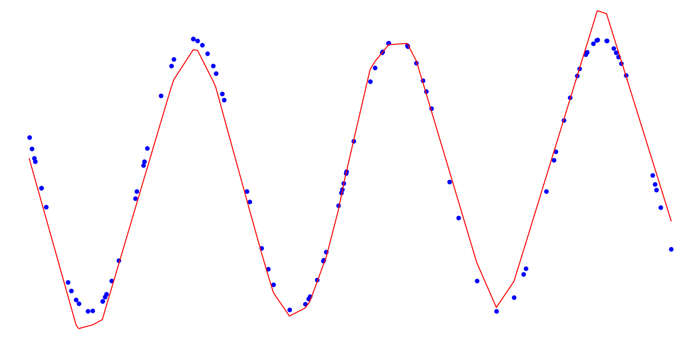

# Adaptive Learning Rates

Implements the adaptive learning rates presented in 8.5:
 * AdaGrad
 * RMSProp
 * RMSProp with momentum
 * Adam

Using Adam resulted in a significant speedup (~x10) when modeling the sin function, compared to the fixed learning rate implentation.

