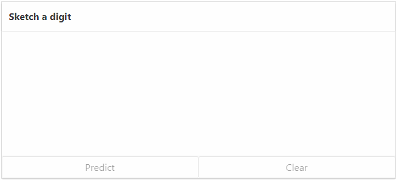

This repository is a collection of code based on my progress through [this book](http://www.deeplearningbook.org) on deep learning.

My latest work is a [digit classifier](exercises/mnist/), where I further develop my [MLP library](8.5/) and train it to recognize digits sketched by a user, using a [ReactJS frontend](exercises/mnist/app/react-app).

### Includes:
The repository includes examples of:

 * Simple classifiers using the iris and mnist datasets (examples)
 * Simple gradient descent and Lagrange multipliers (4.5)
 * Closed-form linear regression (5.1.4-5)
 * Closed-form MLP representation of XOR (6.1)
 * Backpropagation with stochastic gradient descent on a MLP (6.5)
 * Adaptive learning rates and early stopping (8.5)
