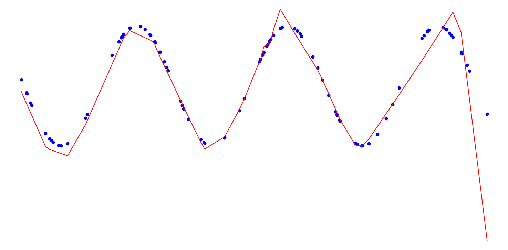

Code based on my progress through [this book](http://www.deeplearningbook.org) on deep learning.

### Includes:
 * Simple classifiers using the iris and mnist datasets (examples)
 * Simple gradient descent and Lagrange multipliers (4.5)
 * Closed-form linear regression (5.1.4-5)
 * Closed-form MLP representation of XOR (6.1)
 * Backpropagation with stochastic gradient descent on a MLP (6.5)
 * Adaptive learning rates and early stopping (8.5)

 ### Screenshot:
 

### Screenshot:

